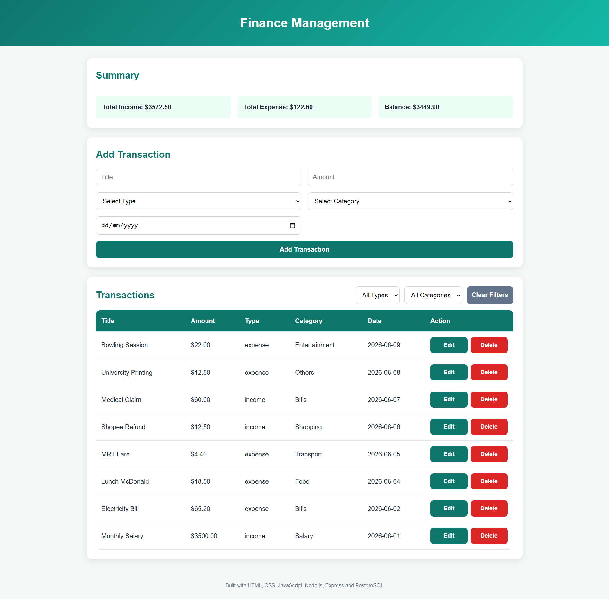

# 💰 Finance Management API

A `RESTful` backend API for managing financial transactions, built with `Node.js`, `Express`, and `PostgreSQL`. The application provides endpoints to **create**, **retrieve**, **update**, **delete**, filter, and summarize income and expense records stored in a relational database.

A lightweight `HTML`, `CSS`, and `JavaScript` frontend was developed as an API consumer to demonstrate end-to-end integration between the client, server, and database layers.

This project was built to strengthen practical backend development skills, including `REST API` design, database modeling, `SQL` query development, middleware validation, and integrating `Node.js` applications with `PostgreSQL` databases.

## 📸 Application Preview



## 🛠️ Technologies Used

**Backend:** `Node.js`, `Express.js`, `PostgreSQL`, `SQL`, `pg` (Node PostgreSQL client), `dotenv`, `CORS` middleware

**Development Tools:** `Postman`, `pgAdmin`, `Nodemon`, `Visual Studio Code`

**Frontend (API Consumer):** `HTML5`, `CSS3`, `Vanilla JavaScript`, `Fetch API`

## ⚙️ Installation & Setup

**1. Clone the repository**

```bash
git clone https://github.com/your-username/finance-management-api.git
cd finance-management-api
```

**2. Install dependencies**

```bash
npm install
```

**3. Configure environment variables**

Create a `.env` file in the project root:

```env
PORT=5000
DB_USER=your_db_user
DB_HOST=localhost
DB_NAME=personal_finance_db
DB_PASSWORD=your_db_password
DB_PORT=5432
```

**4. Set up the PostgreSQL database**

Execute the `SQL` statements in `schema.sql` using **pgAdmin Query Tool** to create the database schema and insert the initial category data.

**5. Start the backend server**

```bash
npm run dev
```

The API will be available at: http://localhost:5000

**6. Launch the frontend**

Open `frontend/index.html` using a local development server (e.g., `VS Code Live Server`) while the backend server is running.

## ✨ Backend Features

### RESTful API Development

- Designed `RESTful` endpoints following standard `HTTP` conventions
- Implemented resource-based routing for transactions and categories

### CRUD Operations

- `Create` new financial transactions
- `Retrieve` individual or multiple transactions
- `Update` existing transaction records
- `Delete` transactions from the database

### Dynamic Filtering

- Supports query parameter filtering:
  - Filter by transaction type
  - Filter by category
  - Combine multiple filters within a single request

### Database Integration

- Connected `Node.js` applications to `PostgreSQL` using connection pooling
- Executed parameterized `SQL` queries to prevent `SQL` injection attacks
- Implemented relational database design using foreign key constraints

### Middleware Validation

- Validated incoming request bodies before controller execution
- Enforced business rules such as:
  - Required fields
  - Positive transaction amounts
  - Valid transaction types

### Financial Summary Endpoint

- Aggregated transaction data using `SQL` functions
- Calculated:
  - Total income
  - Total expenses
  - Overall balance

## 📌 API Endpoints

| Method | Endpoint                    | Description                                   |
| ------ | --------------------------- | --------------------------------------------- |
| GET    | `/api/categories`           | Retrieve all categories                       |
| GET    | `/api/transactions`         | Retrieve all transactions                     |
| GET    | `/api/transactions/:id`     | Retrieve a transaction by ID                  |
| GET    | `/api/transactions/summary` | Retrieve income, expense, and balance summary |
| POST   | `/api/transactions`         | Create a new transaction                      |
| PUT    | `/api/transactions/:id`     | Update an existing transaction                |
| DELETE | `/api/transactions/:id`     | Delete a transaction                          |

## 🗄️ Database Schema

The application uses a relational `PostgreSQL` database consisting of two tables:

| Table          | Purpose                                                              |
| -------------- | -------------------------------------------------------------------- |
| `categories`   | Stores predefined transaction categories (e.g., Food, Salary, Bills) |
| `transactions` | Stores income and expense records linked to categories               |

### Relationship

```text
categories (1) ───────< (many) transactions
```

- `transactions.category_id` references `categories.id`
- Database constraints (`NOT NULL`, `CHECK`, `FOREIGN KEY`) help ensure data integrity
- `ON DELETE RESTRICT` prevents deletion of categories that are associated with existing transactions

> Detailed database creation scripts and seed data are available in `schema.sql`.

## 🧠 Challenges & Solutions

**1. Dynamic SQL Filtering with Multiple Query Parameters**

- **_Challenge:_** Support filtering transactions by type, category, both filters together, or no filters without writing separate `SQL` queries for each scenario.

- **_Solution:_** Constructed `SQL` queries dynamically using arrays for conditions and parameterized placeholders, resulting in a flexible, maintainable, and `SQL` injection-resistant solution.

**2. Understanding End-to-End Request–Response Flow**

- **_Challenge:_** Understanding how data moves between the frontend, `Express` server, `PostgreSQL` database, and back to the browser during `CRUD` operations.

- **_Solution:_** Traced and documented the complete request-response lifecycle, from `Fetch API` requests through `Express` routes, middleware, controllers, `PostgreSQL` queries, `JSON` responses, and DOM updates.

**3. Avoiding Duplicated Validation Logic**

- **_Challenge:_** Both transaction creation and update operations required identical validation rules, leading to potential code duplication.

- **_Solution:_** Extracted validation logic into reusable `Express` middleware, improving maintainability and separation of concerns.

**4. Handling Date Consistency Between PostgreSQL and the Browser**

- **_Challenge:_** `PostgreSQL` `DATE` values were returned as ISO timestamp strings due to timezone conversions, causing unexpected date displays in the frontend.

- **_Solution:_** Formatted dates directly in `SQL` using `TO_CHAR(..., 'YYYY-MM-DD')` to ensure consistent date representation throughout the application.

**5. Implementing CRUD Operations with Express and PostgreSQL**

- **_Challenge:_** Designing `RESTful` endpoints that correctly performed create, read, update, and delete operations while returning meaningful `HTTP` status codes and responses.

- **_Solution:_** Implemented structured controllers using parameterized `SQL` queries, proper error handling, and appropriate `HTTP` response codes to build a reliable API.

**6. Integrating the Frontend with the Backend API**

- **_Challenge:_** Connecting a `JavaScript` frontend to a `Node.js` backend while ensuring data was correctly exchanged between the client and server.

- **_Solution:_** Used the `Fetch API` to send `HTTP` requests, process `JSON` responses, handle errors, and dynamically update the user interface after `CRUD` operations.

## 📚 Learning Outcomes

- Designing `RESTful APIs` using `Express.js`
- Structuring `Node.js` applications using routes, controllers, and middleware
- Connecting backend applications to `PostgreSQL` databases
- Writing `SQL` queries involving filtering, joins, aggregation, and constraints
- Implementing `CRUD` operations using parameterized queries
- Applying middleware-based validation to incoming requests
- Managing application configuration using environment variables
- Testing API endpoints using `Postman`
- Integrating frontend clients with backend services through `HTTP` requests

## 💡 Future Improvements

- Deploy backend API and `PostgreSQL` database to cloud platforms
- Add authentication and authorization for multi-user support
- Implement automated testing for API endpoints and middleware
- Introduce `Docker` and `CI/CD pipelines` to streamline deployment
- Enhance the API with pagination, sorting, and advanced filtering
